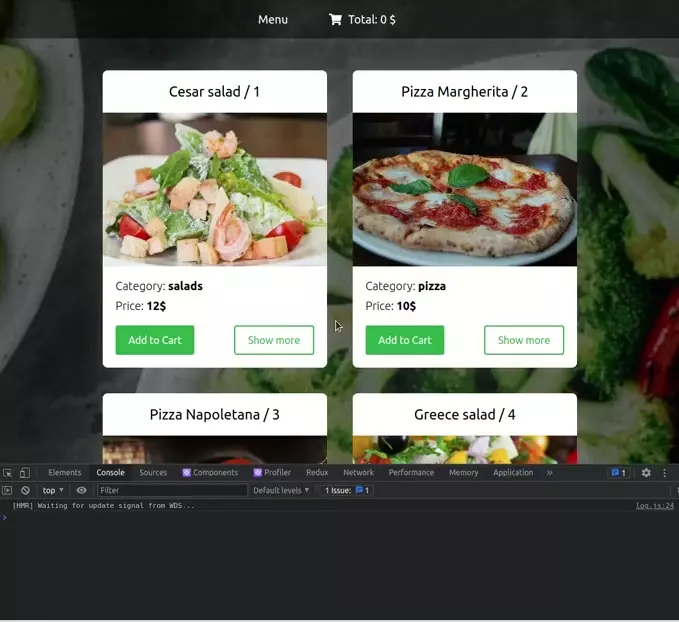

# React-Resto-app

> React training-project from udemy course

## Preview



## What I've learned

- Redux store, actions, reducers
- redux-devtools-extension
- ActionType pattern
- Async actions via `redux-thunk`
- combineReducers
- useDispatch, useSelector
- useParams for Routing

### Backend via local DB

GET requests on `db.json`

```sh
# important order
npx json-server src/db.json
npm start
```

POST requests on `jsonplaceholder`
